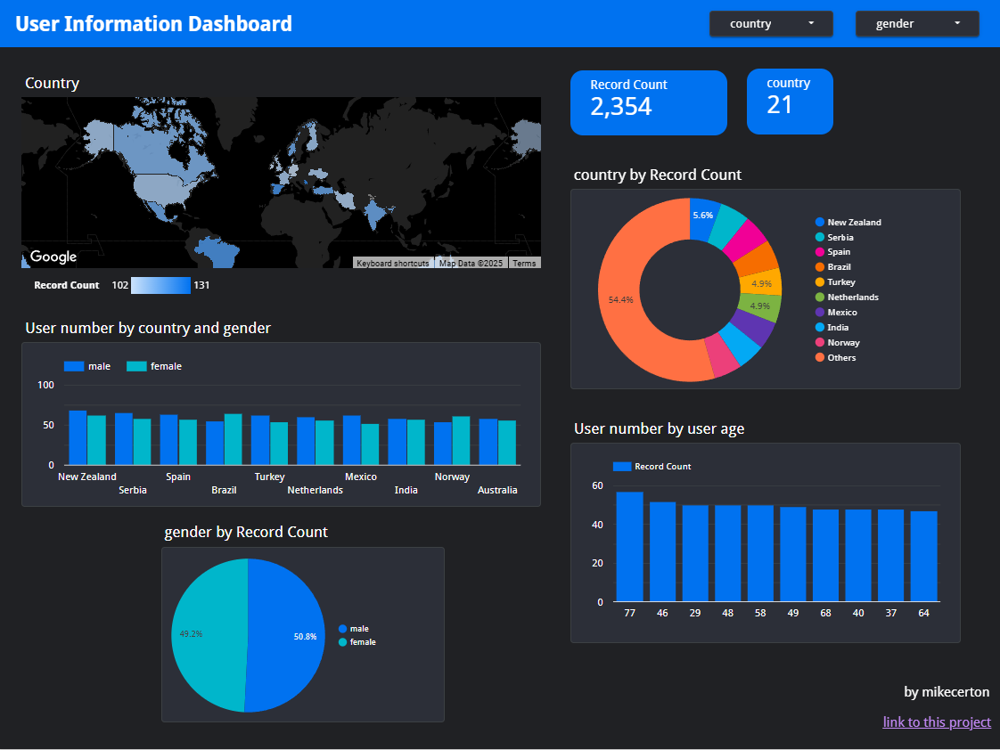

# UserInsight-Streaming-Data-Pipeline
## Overview
&emsp;The UserInsight-Streaming-Data-Pipeline is a real-time data processing pipeline that ingests data from an API into Kafka, processes it using Apache Spark, and stores it in AWS S3. An AWS Lambda function is triggered upon new data arrival in S3, pulling data into AWS Redshift for further analytics and visualization in Looker.key components such as Kafka and Spark can be easily installed and managed using Docker. <br>
!! You can view the dashboard [here. ](https://lookerstudio.google.com/reporting/581cb65a-beb0-45b6-a14c-8f86a316fd18)!! <br>
## Architecture

1. Fetch data from the API and send a message to Kafka. <br>
2. Spark will read data from Kafka and process it. <br>
3. The processed data will be stored in S3 as a data lake. <br>
4. When a new file is saved in S3, it will trigger a Lambda function. <br>
5. The Lambda function will load data from S3 into Redshift. <br>
6. Use data from Redshift to create dashboards in Looker Studio for insights and reporting. <br>

## Dashboard

I use Looker Studio to create dashboards using data from the data warehouse.

!! You can view the dashboard [here. ](https://lookerstudio.google.com/reporting/581cb65a-beb0-45b6-a14c-8f86a316fd18)!! <br>
#### A special note
While developing this project, I connected Looker Studio to AWS Redshift for data. However, due to AWS free tier limits, Redshift cannot run continuously. As a result, the dashboard now uses data from a CSV file exported from Redshift, but it appears the same as when directly connected to Redshift.

## Tools & Technologies
- Cloud: Amazon Web Services (AWS) <br>
- Containerization - Docker, Docker Compose <br>
- Stream Processing: Apache Kafka, Apache Spark <br>
- Data Lake: AWS S3 <br>
- Serverless Computing: AWS Lambda <br>
- Data Warehouse: AWS Redshift <br>
- Data Visualization: Looker Studio <br>
- Programming Language: Python <br>

## Set up
#### 1. Clone the Repository <br>
Clone the GitHub repository and navigate to the project directory:
```bash
git clone https://github.com/mikecerton/UserInsight-Streaming-Data-Pipeline.git
cd UserInsight-Streaming-Data-Pipeline
```
#### 2. Set Up AWS Services <br>
Ensure the following AWS resources are created before running the pipeline:
- Amazon Redshift – for data warehousing
- Amazon S3 – for storing processed data
- AWS Lambda – for automating data transfers
#### 3. Configure Environment Variables
Create a .env file in the project root directory and add your AWS and Kafka credentials:
```bash
AWS_ACCESS_KEY_ID = you_data
AWS_SECRET_ACCESS_KEY = you_data
AWS_REGION = you_data

kafka_servers = you_data
kafka_cid = you_data
kafka_topic_name = you_data
link_api = you_data

s3_output_path = you_data

redshift_host = you_data
redshift_port = 5you_data
redshift_db = you_data
redshift_user = you_data
redshift_password = you_data
iam_role = you_data
```
Note: Keep your .env file secure and do not share it publicly. <br>
#### 4. Start Docker Containers <br>
Run the following command to start Kafka and Spark services:
```bash
docker-compose -f docker_kafka.yml -f docker_spark.yml up -d
```
#### 5. Run the Spark Streaming Job <br>
Execute the Spark job to process data from Kafka and store it in S3: 
```bash
spark-submit --packages org.apache.spark:spark-sql-kafka-0-10_2.12:3.5.5 /opt/bitnami/my_spark/spark_stream_s3.py
```

## Disclaimer
- RandomUser : <br>
&emsp;https://randomuser.me/documentation <br>
- Apache Kafka : <br>
&emsp;https://kafka.apache.org/documentation/ <br>
&emsp;https://hub.docker.com/r/apache/kafka <br>
- Apache Spark : <br>
&emsp;https://spark.apache.org/docs/latest/ <br>
&emsp;https://hub.docker.com/_/spark/ <br>
&emsp;https://bitnami.com/stacks/spark <br>
&emsp;https://hub.docker.com/r/bitnami/spark/ <br>
- AWS : <br>
&emsp;https://docs.aws.amazon.com/s3/ <br>
&emsp;https://docs.aws.amazon.com/redshift/ <br>
&emsp;https://docs.aws.amazon.com/lambda/ <br>

